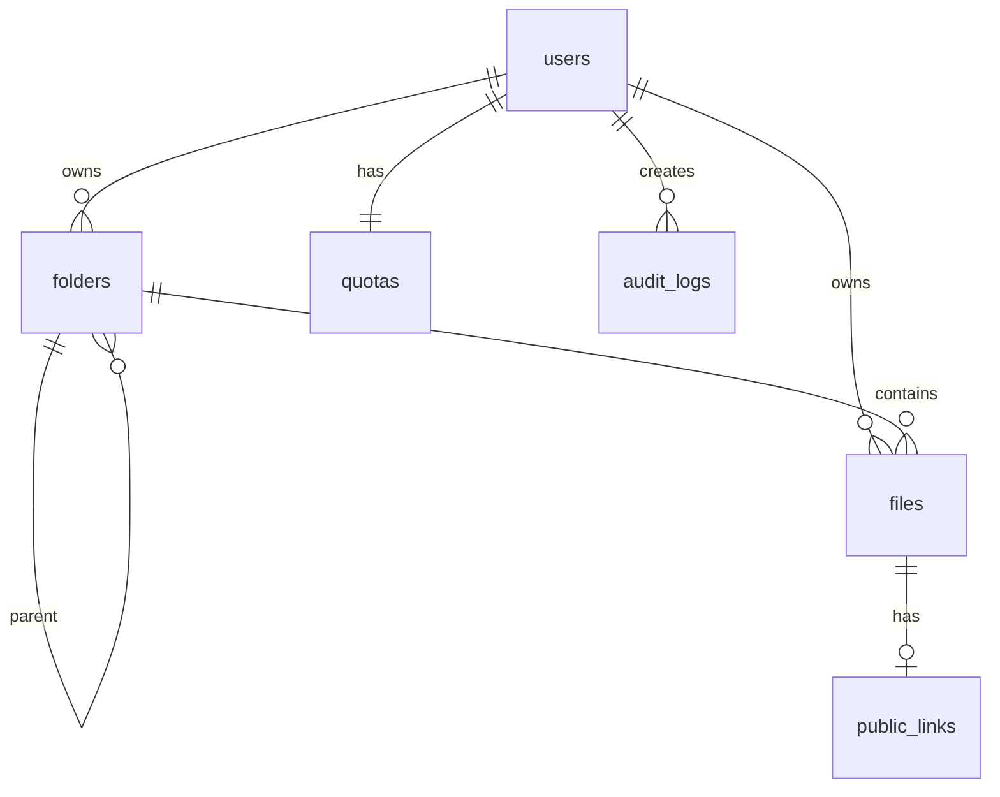

# Database Design

## Project

Cloud Storage Web Application

---

# Overview

Database digunakan hanya untuk menyimpan metadata.

Seluruh file disimpan di Object Storage (S3 Compatible).

Database tidak pernah menyimpan binary file.

---

# Database

PostgreSQL

---

# ID Strategy

Semua Primary Key menggunakan UUID v7.

Alasan:

- Tidak mudah ditebak
- Cocok untuk distributed system
- Mudah digunakan pada Public API
- Mendukung sorting berdasarkan waktu

---

# Naming Convention

Table

snake_case

Column

snake_case

Primary Key

id

Foreign Key

{table}\_id

Timestamp

created_at
updated_at

Soft Delete

deleted_at

---

# ERD



---

# Tables

1. users
2. quotas
3. folders
4. files
5. public_links
6. audit_logs

---

# users

Purpose

Menyimpan akun pengguna.

| Column     | Type         | Constraint |
| ---------- | ------------ | ---------- |
| id         | UUID         | PK         |
| name       | varchar(100) | NOT NULL   |
| email      | varchar(255) | UNIQUE     |
| password   | text         | NOT NULL   |
| created_at | timestamptz  | NOT NULL   |
| updated_at | timestamptz  | NOT NULL   |

---

# quotas

Satu user memiliki satu quota.

| Column       | Type        |
| ------------ | ----------- |
| id           | UUID        |
| user_id      | UUID UNIQUE |
| max_storage  | bigint      |
| used_storage | bigint      |
| created_at   | timestamptz |
| updated_at   | timestamptz |

Default

```
1 GB
```

---

# folders

Folder virtual.

Tidak ada folder di Object Storage.

Semua folder hanyalah metadata.

| Column           | Type             |
| ---------------- | ---------------- |
| id               | UUID             |
| owner_id         | UUID FK          |
| parent_folder_id | UUID FK NULL     |
| name             | varchar(255)     |
| deleted_at       | timestamptz NULL |
| created_at       | timestamptz      |
| updated_at       | timestamptz      |

Rules

Root Folder

parent_folder_id = NULL

Delete Folder

Tidak langsung dihapus.

Masuk Trash.

---

# files

Metadata file.

## IMPORTANT

Object Storage hanya mengenal object key.

Nama file yang dilihat user berada di database.

| Column        | Type         |
| ------------- | ------------ |
| id            | UUID         |
| owner_id      | UUID FK      |
| folder_id     | UUID FK      |
| original_name | varchar(255) |
| storage_key   | text         |
| mime_type     | varchar(255) |
| extension     | varchar(30)  |
| size          | bigint       |
| checksum      | varchar(64)  |
| upload_status | varchar(30)  |
| deleted_at    | timestamptz  |
| created_at    | timestamptz  |
| updated_at    | timestamptz  |

---

# upload_status

Enum

```
uploading

uploaded

failed
```

Flow

```
Init Upload

↓

uploading

↓

Complete Upload

↓

uploaded
```

---

# storage_key

Contoh

```
uploads/01K3....
```

Bukan

```
photo.png
```

Storage Key tidak pernah berubah.

Rename hanya mengubah original_name.
[118;1:3u

---

# public_links

Digunakan untuk share file.

| Column     | Type                |
| ---------- | ------------------- |
| id         | UUID                |
| file_id    | UUID FK UNIQUE      |
| token      | varchar(255) UNIQUE |
| expired_at | timestamptz NULL    |
| created_at | timestamptz         |

Public URL

```
/public/{token}
```

---

# audit_logs

Mencatat aktivitas penting.

| Column        | Type         |
| ------------- | ------------ |
| id            | UUID         |
| user_id       | UUID         |
| action        | varchar(100) |
| resource_type | varchar(50)  |
| resource_id   | UUID         |
| metadata      | jsonb        |
| created_at    | timestamptz  |

Contoh Action

```
LOGIN

UPLOAD_FILE

CREATE_FOLDER

RENAME_FILE

DELETE_FILE

RESTORE_FILE

EMPTY_TRASH

GENERATE_PUBLIC_LINK

REVOKE_PUBLIC_LINK
```

---

# Index

users

```
email
```

folders

```
owner_id
parent_folder_id
deleted_at
```

files

```
owner_id
folder_id
deleted_at
original_name
storage_key
```

public_links

```
token
```

audit_logs

```
user_id
created_at DESC
```

---

# Object Storage Mapping

Database

```
id

folder_id

original_name

storage_key
```

Object Storage

```
storage_key

↓

uploads/01K4ABCDEF...
```

---

# Quota

Saat upload selesai

```
used_storage += file_size
```

Saat Permanent Delete

```
used_storage -= file_size
```

---

# Scheduler

Scheduler berjalan setiap 1 jam.

## Auto Move To Trash

Cari

```
created_at <= NOW() - 24 jam

AND

deleted_at IS NULL
```

Action

```
deleted_at = NOW()
```

---

## Auto Permanent Delete

Cari

```
deleted_at <= NOW() - 24 jam
```

Action

1.

Delete Object Storage

↓

2.

Kurangi Quota

↓

3.

Delete Metadata

---

# Delete Flow

```
Upload

↓

Active

↓

Trash

↓

Permanent Delete
```

---

# Restore Flow

```
Trash

↓

Restore

↓

Active
```

---

# Search

Search hanya berdasarkan

```
original_name
```

Menggunakan

```
ILIKE
```

---

# Transaction

Wajib menggunakan Database Transaction pada

- Complete Upload
- Delete File
- Restore File
- Empty Trash
- Permanent Delete
- Create Folder
- Rename Folder

---

# Future Feature

Belum termasuk

- Shared Folder
- Role Permission
- File Versioning
- Favorite
- Starred
- Recent
- Activity Feed
- Notification
